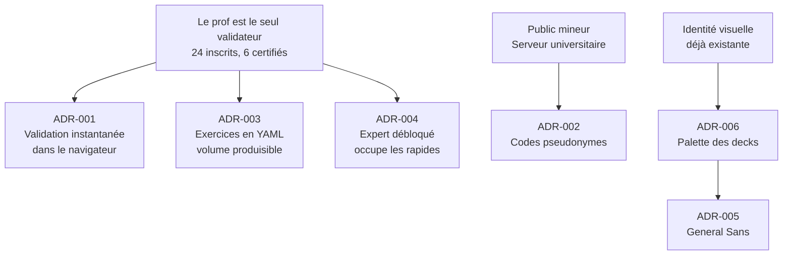

# Journal de décisions

Une note par décision structurante. Le format est fixe : contexte, décision, conséquences,
alternatives écartées. ==On ne réécrit jamais une décision : on en publie une nouvelle qui la
remplace.==

Toutes acceptées le 3 septembre 2026.

- **001** — [[ADR-001 Exécution du code dans le navigateur]]
  Le Python des élèves tourne dans leur navigateur, jamais sur le serveur.
- **002** — [[ADR-002 Identification par code d'agent]]
  Connexion par code pseudonyme ; aucune donnée personnelle stockée.
- **003** — [[ADR-003 Exercices versionnés en YAML]]
  Les exercices sont des fichiers Git, pas des lignes de base de données.
- **004** — [[ADR-004 Mode expert en bonus débloqué]]
  Expert = bonus après le normal, pas un parcours parallèle.
- **005** — [[ADR-005 Typographie General Sans]]
  General Sans remplace les polices des decks ; la chasse fixe ne sort jamais du code.
- **006** — [[ADR-006 Palette dérivée des slides]]
  La palette et la règle pastel/sombre sont relevées dans les decks, pas inventées.

Les deux suivantes ont été prises **pendant l'implémentation**, sous la contrainte du code réel.
Ce sont celles qu'un lecteur risque le plus de défaire par ignorance.

- **007** — [[ADR-007 Worker classique et chargement de Pyodide]]
  Le worker est classique, pas un module : Vite refuse de servir `public/` à un `import()`.
- **008** — [[ADR-008 Validation serveur des champs libres]]
  Toute chaîne acceptée par l'API est validée par motif ou liste blanche, **côté serveur**.

## Le fil conducteur

Cinq de ces six décisions découlent d'un même constat, établi dans [[Bilan 2025-2026]] :
**le professeur était le seul validateur de la salle**, et c'est ce goulot qui a produit
l'abandon. Chaque décision se relit à travers cette question.

## Ce qui n'est pas encore décidé

- [ ] Le nombre exact d'exercices du chapitre 1 et leur ordre — voir [[Chapitre 1]]
- [ ] La forme précise de la gamification (points, classement, badges)
- [ ] Le découpage du livrable de la séance 1 par rapport au reste
