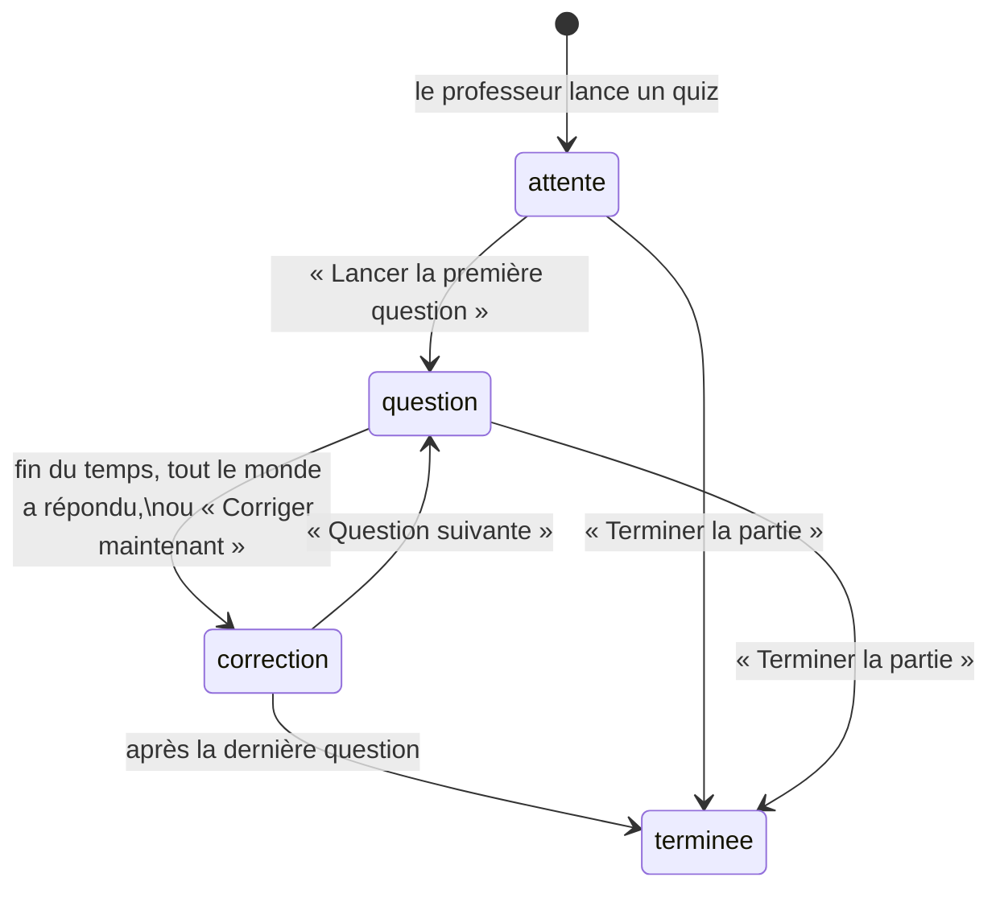

# Quiz en direct

Le professeur lance une partie depuis son tableau de bord ; les élèves la rejoignent depuis leur
espace, répondent à des questions en temps limité ; l'écran projeté montre la correction, la
répartition des réponses et les cinq premiers. Décisions : [[ADR-015 Quiz en direct et
classement encadré]] · [[ADR-016 Temps réel par sonnette WebSocket]]. Plan : [[Plan quiz]].

## Le déroulé



==La correction ne s'écrit jamais en base.== La table ne connaît que `attente`, `question` et
`terminee` ; une question dont l'échéance `fin_a`, plus 500 ms de tolérance, est passée **est**
corrigée, à la lecture. « Corriger maintenant » recule l'échéance au lieu d'écrire une phase. Il
n'existe donc qu'une façon d'entrer en correction, et aucun minuteur serveur à perdre au
redémarrage.

## Qui voit quoi

| | Pendant la question | À la correction | En fin de partie |
|---|---|---|---|
| **Élève** | la question, son choix | la bonne réponse, juste ou pas, ses points, **son** rang | son bilan : bonnes réponses, points, rang |
| **Élève, en salle d'attente** | qui est prêt : un rond et un « Prénom N. » par joueur, le sien marqué « toi » | | |
| **Écran projeté** | la question, le nombre de réponses reçues | la bonne réponse, la répartition, l'explication, les cinq premiers | le podium, le bilan anonyme question par question |

Ce que personne ne reçoit : un code d'accès d'un autre élève — le repli d'un élève sans prénom
est « Élève », à l'écran projeté comme chez l'élève. La bonne réponse avant la correction — ni l'élève, ni l'écran projeté,
qui est au mur. Des points qui trahiraient une réponse juste avant la correction. Le nom d'un
autre élève, côté élève. Un classement au-delà de cinq, ou quelqu'un à zéro point. Tout cela est
tenu **par le serveur**, dans `api/app/quiz.py` : `vue_eleve` et `vue_prof` sont les seules
fonctions qui fabriquent ce qu'un écran reçoit, et des tests de fuite les vérifient.

## Côté élève, hors de la page du quiz

La coquille de l'élève garde sa propre sonnette sur toutes les pages. Dès que le professeur crée
une partie, deux choses s'allument dans la seconde : le **bandeau** « Un quiz a commencé »,
collé sous l'en-tête même au fond d'un long exercice, et l'entrée **Quiz en direct**, toujours
en tête du sommaire, grisée tant qu'aucune partie n'est ouverte. Les deux s'éteignent dès que la
partie se termine. Sans WebSocket, elles relisent toutes les dix secondes — pas chaque seconde :
elles n'ont qu'à savoir si une partie existe.

Les arrivées sonnent chez tout le monde **en salle d'attente**, où chacun voit les autres
arriver ; en cours de partie, chez le professeur seulement.

## Le cours fermé pendant une partie

De la création d'une partie à sa fin, **tout le cours se ferme** chez tous les élèves : les
chapitres du sommaire deviennent inertes (grisés, ni clic ni clavier), et une page de cours
ouverte passe sous un panneau « Le cours est fermé pendant le quiz », avec **Aller au quiz**.
Seule l'entrée du quiz reste ouverte. Le verrou porte sur le cours entier, pas sur une liste de
chapitres : un chapitre ajouté plus tard se ferme de lui-même.

Fermé pour tous, et pas seulement pour les joueurs : répondre vaut rejoindre, et un élève qui
n'aurait pas rejoint pourrait sinon chercher la réponse dans le cours avant de cliquer.

La page reste **montée** sous le panneau (attribut `inert`) : l'élève qui écrivait du code au
moment où la partie commence le retrouve intact à la fin. En fin de partie, **Retourner au
cours** le ramène à la dernière page de cours qu'il avait ouverte.

> [!note] Une consigne de classe, pas une barrière de sécurité
> Le contenu du cours est public (`/contenu/*.json`) : un élève décidé l'ouvre par les outils de
> développement ou sur un autre appareil. Le verrou retire la tentation, il ne la rend pas
> impossible — comme un cahier fermé sur la table.

## Côté professeur, où mène chaque fin

| Situation | Écran |
|---|---|
| La page s'ouvre, aucune partie en cours (jamais jouée, ou déjà finie) | le catalogue, avec « Derniers résultats » |
| La page s'ouvre sur une partie en cours | la partie, là où elle en est |
| La partie finit sous les yeux de la classe, avec des réponses | le podium et le bilan, puis **Nouvelle partie** → catalogue |
| La partie est arrêtée sans aucune réponse | le catalogue |

## Les derniers résultats

Depuis le catalogue, le professeur lit pour chaque quiz le taux de bonnes réponses de sa
dernière partie jouée (« 68 % de bonnes réponses, 21 élèves »), et l'ouvre en entier avec
**Derniers résultats** : le même bilan anonyme qu'en fin de partie. Une partie sans réponse —
annulée en salle d'attente, ou celle du test de charge — est ignorée : elle ne masque pas la
précédente.

## Le barème

1000 points pour une réponse juste immédiate, 500 à la dernière seconde, linéaire entre les deux ;
0 pour une réponse fausse. La réponse est chronométrée **à la réception par le serveur**, depuis
l'ouverture de la question. Ex æquo, même rang : 1, 1, 3.

## Les pièces

```
contenu/chapitre-1/quiz/*.yaml   les quiz, écrits à la main
outils/construire_quiz.py        YAML -> JSON, pour l'image de l'API SEULEMENT
api/app/
  quiz.py                        la règle du jeu, fonctions pures
  catalogue.py                   lit les quiz construits (DOJO_QUIZ)
  diffuseur.py                   la sonnette : registre des WebSocket ouverts
  routes_quiz.py                 routes élève, routes prof, WS /quiz/flux
web/src/
  quiz/horloge.ts                l'heure du serveur, le temps restant
  quiz/flux.ts                   sonnette + relève de repli
  quiz/useFluxQuiz.ts            le même, branché sur React
  ui/EcranQuiz.tsx               l'élève, sur /quiz
  ui/QuizProf.tsx                l'écran projeté, sur /prof/quiz
  ui/BandeauQuiz.tsx             « Un quiz a commencé », collé sous l'en-tête
  ui/Menu.tsx                    « Quiz en direct » en tête du sommaire, grisé sans partie
  ui/PastillesJoueurs.tsx        les élèves prêts, un rond chacun, des deux côtés
  ui/OptionsQuiz.tsx             les quatre options, une famille chacune
deploiement/charge_quiz.py       le test de charge
```

## Les routes

| Route | Qui | Rôle |
|---|---|---|
| `GET /quiz/etat` | élève | la partie vue par lui ; une partie finie seulement s'il l'a jouée, un quart d'heure |
| `POST /quiz/rejoindre` | élève | entrer dans la partie en cours |
| `POST /quiz/reponse` | élève | `{partie, question, choix}` — répondre vaut rejoindre |
| `GET /prof/quiz` | prof | le catalogue, et pour chaque quiz le taux de réussite de sa dernière partie |
| `GET /prof/quiz/{id}/resultats` | prof | le bilan anonyme de la dernière partie jouée de ce quiz |
| `POST /prof/quiz/parties` | prof | une partie à la fois, sinon 409 |
| `GET /prof/quiz/partie` | prof | la dernière partie, même terminée : son bilan reste lisible |
| `POST /prof/quiz/partie/suivante` · `corriger` | prof | portent le rang que l'écran croit courant : un double clic est refusé |
| `POST /prof/quiz/partie/terminer` | prof | arrête pour tout le monde |
| `WS /quiz/flux` | les deux | la sonnette ; présentation dans le premier message, jamais dans l'URL |

## Écrire un quiz

```yaml
id: q1-bases                 # q + séance + nom
titre: Les bases de la séance 1
seance: 1
questions:
  - enonce: Qu'affiche ce programme ?
    code: |
      print("2" + "2")
    options: ["22", "4", "2 2", "Une erreur"]   # 2 à 4, distinctes, 90 caractères au plus
    bonne_reponse: 0
    duree_s: 20                                 # 10 à 60
    sortie: true                                # la bonne réponse EST ce que le code affiche
    explication: Deux textes se collent, ils ne s'additionnent pas.
```

`sortie: true` fait exécuter le code à la construction et comparer sa sortie à l'option juste.
`erreur: TypeError` vérifie que le code plante bien ainsi. Un code qui appelle `input()` déclare
ses `entrees`. Tout code montré doit tourner. ==Varier la position de la bonne réponse== : une
classe qui repère « c'est toujours la première » ne joue plus.

```bash
cd plateforme/outils
.venv/Scripts/python valider_contenu.py ../contenu/chapitre-1   # valide aussi les quiz
.venv/Scripts/python construire_quiz.py                          # -> ../api/quiz, pour le développement
```

## Mesures

Test de charge du 27 septembre 2026 (`deploiement/charge_quiz.py`), `docker compose` sur un poste
de développement, à travers Caddy, 24 élèves simulés, 3 questions : réponses en **75 ms** de
médiane (p95 116 ms), sonnette reçue **70 ms** après « Question suivante », aucune erreur.

> [!todo] Reste à faire en salle
> Vérifier depuis le réseau d'un établissement que le WebSocket passe. S'il ne passe pas, rien ne
> casse — chaque écran relit toutes les secondes —, mais il faut le savoir.

## Voir aussi

[[ADR-015 Quiz en direct et classement encadré]] · [[ADR-016 Temps réel par sonnette WebSocket]] ·
[[Charte visuelle]] · [[Pièges et invariants]] · [[Vue d'ensemble]]
