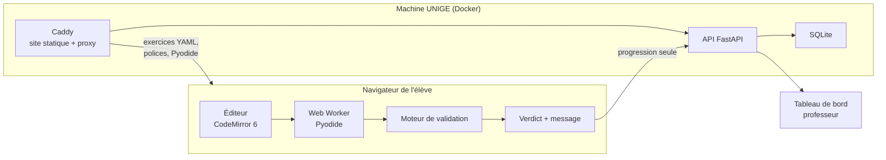

# Vue d'ensemble

## Le principe

==Le code des élèves ne quitte jamais leur navigateur.== La machine UNIGE ne voit passer que des
verdicts et de la progression. Cette séparation est la conséquence directe de
[[ADR-001 Exécution du code dans le navigateur]] et elle simplifie tout le reste : sécurité,
montée en charge, dossier d'hébergement.

## La pile

| Couche | Choix | Pourquoi ce choix précis |
|---|---|---|
| Éditeur | **CodeMirror 6** | 200 Ko contre 2 Mo pour Monaco, coloration Python native, utilisable sur tablette |
| Exécution | **Pyodide** dans un **Web Worker** | Voir [[Moteur d'exécution]] — le worker n'est pas optionnel |
| Front | Vite + TypeScript | Construction statique, servie par Caddy |
| API | **FastAPI** (Python) | ==Le professeur est professeur de Python.== Il pourra maintenir ce backend seul dans six mois. C'est le critère décisif, pas la performance |
| Base | **SQLite** dans un volume Docker | 24 élèves. Postgres serait de la mise en scène. Zéro administration |
| Déploiement | **docker compose**, 2 services | Voir [[Déploiement UNIGE]] |

## Les pièces et leurs notes

- [[Moteur d'exécution]] — comment le Python tourne, et comment on tue une boucle infinie
- [[Moteur de validation]] — les quatre types de test
- [[Modèle de contenu]] — la structure d'un exercice
- [[Messages d'erreur en français]] — la pièce qui remplace le professeur
- [[Déploiement UNIGE]] — conteneurs, sauvegardes, dossier de sécurité

## Ce que l'API expose

Volontairement minimal — chaque point d'entrée supplémentaire est du code à écrire et à défendre.

| Route | Rôle |
|---|---|
| `POST /session` | Échange un code d'agent contre un jeton de session |
| `GET /parcours` | Renvoie les exercices débloqués pour cet agent |
| `POST /tentative` | Enregistre une tentative : exercice, verdict, type d'erreur, durée |
| `GET /prof/seance` | Alimente le tableau de bord — voir [[ADR-002 Identification par code d'agent]] |
| `POST /prof/verrou` | Ouvre ou ferme un concept pour toute la classe |

> [!note] Ce que l'API ne reçoit jamais
> Le code source écrit par l'élève. Seuls le verdict et le **type** d'erreur remontent
> (`TypeError`, `NameError`, …), ce qui suffit au tableau de bord sans lire par-dessus l'épaule.
