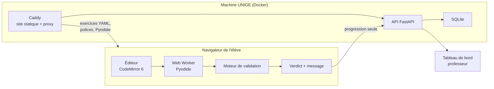

# Vue d'ensemble

## Le principe

==Le code des élèves ne quitte jamais leur navigateur.== La machine UNIGE ne voit passer que des
verdicts et de la progression. Cette séparation est la conséquence directe de
[[ADR-001 Exécution du code dans le navigateur]] et elle simplifie tout le reste : sécurité,
montée en charge, dossier d'hébergement.



## La pile

| Couche | Choix | Pourquoi ce choix précis |
|---|---|---|
| Éditeur | **CodeMirror 6** | 200 Ko contre 2 Mo pour Monaco, coloration Python native, utilisable sur tablette |
| Exécution | **Pyodide** dans un **Web Worker** | Voir [[Moteur d'exécution]] — le worker n'est pas optionnel |
| Front | Vite + TypeScript | Construction statique, servie par Caddy |
| API | **FastAPI** (Python) | ==Le professeur est professeur de Python.== Il pourra maintenir ce backend seul dans six mois. C'est le critère décisif, pas la performance |
| Base | **SQLite** dans un volume Docker | 24 élèves. Postgres serait de la mise en scène. Zéro administration |
| Déploiement | **docker compose**, 2 services | Voir [[Déploiement UNIGE]] |

## Les pièces et leurs notes

- [[Moteur d'exécution]] — comment le Python tourne, et comment on tue une boucle infinie
- [[Moteur de validation]] — les quatre types de test
- [[Modèle de contenu]] — la structure d'un exercice et d'une leçon
- [[Messages d'erreur en français]] — la pièce qui remplace le professeur
- [[Déploiement UNIGE]] — conteneurs, sauvegardes, dossier de sécurité
- [[Pièges et invariants]] — ce qui a l'air arbitraire et ne l'est pas
- [[ADR-009 Routage maison sans bibliothèque]] — les quatre formes d'adresse

## Les pièces du front

```
web/src/
  routage.ts              analyser() · versChemin() · naviguer() · useRoute()
  app.tsx                 la coquille : en-tête, menu, aiguillage, alerte réseau
  contenu/
    types.ts              Exercice · Notion · Lecon · Bloc
    chargeur.ts           chargerJson() et les trois chargeurs
    notions.ts            grouper() · premiereOuverte()   (fonctions pures)
  ui/
    Menu.tsx              la colonne permanente des notions
    PageCours.tsx         la leçon d'une notion, sur fond pastel
    BacASable.tsx         « Essayer » : un éditeur sans verdict ni progression
    PageExercices.tsx     la liste d'exercices d'une notion
    EcranExercice.tsx     un exercice ouvert, sur fond sombre
    EcranConnexion.tsx    la porte d'entrée
    texte.tsx             formaterTexte() : **gras** et `code`, rien d'autre
```

==La logique vit dans les fonctions pures== — `routage.ts`, `notions.ts`, `texte.tsx`,
`validation/` — qui se testent sans DOM ni serveur. Les composants affichent et délèguent.

## Ce que l'API expose

Volontairement minimal — chaque point d'entrée supplémentaire est du code à écrire et à défendre.

| Route | Rôle |
|---|---|
| `POST /session` | Échange un code d'accès (`DOJO-XXXX`) contre un jeton de session. **404 si le code n'est pas dans la classe** |
| `GET /parcours` | Renvoie les exercices déjà réussis par cet élève |
| `POST /tentative` | Enregistre une tentative : exercice, verdict, type d'erreur, durée |
| `GET /prof/seance` | Alimente le [[Tableau de bord]] : une ligne par élève, sans jamais son code source |
| `GET /prof/eleves` | La liste de la classe, avec le nombre de tentatives de chacun |
| `POST /prof/eleves` | Inscrit un élève ; **le serveur tire le code**, jamais l'appelant |
| `PATCH /prof/eleves/{code}` | Corrige prénom, nom, établissement — jamais le code |
| `DELETE /prof/eleves/{code}` | Retire un élève **et ses tentatives** |

> [!note] Ce que l'API ne reçoit jamais
> Le code source écrit par l'élève. Seuls le verdict et le **type** d'erreur remontent
> (`TypeError`, `NameError`, …), ce qui suffit au tableau de bord sans lire par-dessus l'épaule.
