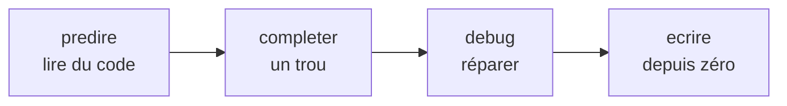

# Types d'exercices

Quatre types, un ordre de difficulté croissante, appliqué **à l'intérieur de chaque notion**.

On ne demande jamais à un novice d'**écrire** du code avant de lui avoir fait **lire** et
**tracer** du code.

## `predire` — 43 exercices, le type dominant

On montre du code, l'élève dit ce qui s'affiche. QCM, aucune écriture, aucune syntaxe à maîtriser.

> [!important] C'est le seul type sur lequel un débutant absolu ne peut pas rester bloqué
> Il n'y a rien à taper, donc rien à rater. C'est pour ça qu'il représente près de 40 % du
> chapitre, et qu'il ouvre chaque notion.

Les énoncés doivent être ==lisibles sans vocabulaire anglais ni prérequis mathématique== : avec
24 élèves venus de 8 établissements sans prérequis, un QCM formulé en jargon transforme
l'exercice imbloquable en exercice bloquant.

## `debug` — 29 exercices

Un code cassé, l'élève répare. Le bug est authentique : voir [[Bugs réels de la promotion 2025]].

Formateur parce qu'il fait rencontrer l'erreur **sous contrôle**, avant qu'elle ne surprenne
l'élève dans son propre code. L'`IndentationError` de la séance 2 est rencontrée en `debug`
avant d'être subie.

## `completer` — 18 exercices

Des trous `_____` dans un code fourni. C'est le format hérité des notebooks 2025, conservé parce
qu'il fonctionne. Validé par inspection de variables plutôt que par comparaison de sortie —
voir [[Moteur de validation]].

## `ecrire` — 22 exercices

Écriture depuis zéro, validée par sortie attendue ou inspection de variables.

> [!danger] Motifs interdits obligatoires, sans exception
> ==Sur tout exercice `ecrire`, sans motif `interdit`, l'élève rapide code la sortie attendue en
> dur dans un `print` et le moteur valide.==
>
> Cas particulier à ne pas oublier : l'exercice d'échange de valises doit interdire
> `a, b = b, a` — syntaxe non enseignée qui rend l'exercice trivial et court-circuite la notion
> de variable temporaire qu'il vise.

## Le ratio expert

23 experts pour 89 exercices normaux, soit environ **1 pour 4**, et croissant d'une séance à
l'autre (5, 8, 10) — là où les rapides décrochent d'ennui.

Les experts sont des **problèmes**, pas des points de syntaxe.

> [!warning] Risque social du mode expert
> Rendre visible qui a débloqué quoi recréerait une classe à deux vitesses devant 24 élèves de
> 8 établissements qui ne se connaissent pas.
>
> Mitigation retenue : les experts ==ne sont pas notés, ne comptent pas dans la progression
> affichée==, et la certification ne dépend que du parcours obligatoire.
> Voir [[ADR-004 Mode expert en bonus débloqué]].
